# FunnelForge

A desktop application that designs, validates, and exports ready-to-run file
sets for one-dimensional, well-tempered funnel-metadynamics potentials for
Desmond in 3D. It is not a web interface; it is a native application written
with PyQt5 + VTK.

Reference job: `funnel_metadaynamics_ayrilma_Z5_run.{pot,msj,cfg,sh,cms}`
(62,870 atoms, an 85.8 × 86.6 × 89.1 Å SPC water box, Z5 ligand = chain B /
LIG, 72 heavy atoms).

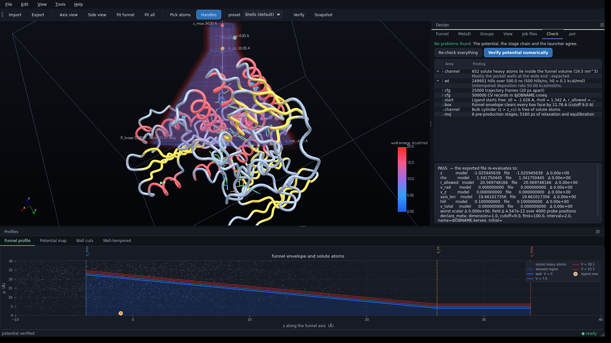

---

## Custom package compatibility — 2026-09-05

**File ▸ Import job set…** now opens ZIP packages directly. For example:

```bash
conda activate cugraph_env
python -m funnelforge /home/bugra/Downloads/AChE-G6N_WT_funnel_MetaD_package.zip
```

Custom protein reference frames, different variable names, custom radius/wall
expressions, and additional energy contributions are read from the source
text. Position, lateral shift, tilt, and numerical settings can be edited with
the existing controls; the theme and panel layout are unchanged. Editing
changes only the relevant expressions in the source; custom forces, comments,
and diagnostic expressions are not lost. Unedited `.pot` text is preserved
byte-for-byte.

The runnable export removes a UTF-8 BOM if present because Desmond does not
accept it, and reports that action; the source record preserves the original
bytes.

Export compares the GUI model with the file's actual energy expression at
4,000 positions, checks startup dependencies and file references, and does not
write a partial package if an error is found. Helper scripts are preserved,
file names and the checksum manifest are updated. Validation scripts fixed to
the old geometry are kept as source evidence; the new package starts with an
up-to-date validation record and the existing Desmond pre-check. The default
output folder is `<jobname>_export`, separate from the source files.

Import/editing has been validated with real AChE-G6N and BChE-G4N packages.
Current scope and engine limits: [docs/known-limitations.md](docs/known-limitations.md).

---

## 1. Installation and launch

Dependencies are ready in the `cugraph_env` environment (numpy, scipy, vtk
9.3, PyQt5 5.15, matplotlib). If anything is missing:

```bash
./install.sh
```

Launch:

```bash
cd /home/bugra/Claude/potantial && ./funnelforge.sh /home/bugra/Downloads/funnel_metadaynamics_ayrilma_Z5_run.pot
```

If you do not provide a file name, the application opens empty. Use **File ▸
Import job set…** and select any one of the five files: `.pot / .cms / .msj /
.cfg / .sh` files with the same base name are imported **as a set**. To create
a desktop shortcut, copy `FunnelForge.desktop` into
`~/.local/share/applications/`.

You can also activate `cugraph_env` and run it directly:

```bash
cd /home/bugra/Claude/potantial && python -m funnelforge ~/Downloads/funnel_metadaynamics_ayrilma_Z5_run.pot
```

---

## 2. Screen layout

| Area | Contents |
|---|---|
| Center | 3D scene: protein, ligand, cofactors, ions, water, periodic box, funnel, and handles |
| Right (Design) | `Funnel`, `Shapes`, `MetaD`, `Groups`, `View`, `Job files`, `Check`, and `.pot` tabs |
| Bottom (Profiles) | `Funnel profile`, `Potential map`, `Wall cuts`, and `Well-tempered` plots |
| Status bar | Structure summary · atom under the cursor · validation status (● green/yellow/red) |

Panels can be hidden/shown with `F9` / `F10`, dragged, and detached.

---

## 3. Adjusting the funnel in 3D

> **Important:** If none of the imported files is a `.pot`, **no funnel is
> created** and the previous job's funnel is not carried over. A new import
> resets everything: the funnel is off, the shape list is empty, and the
> geometry is zeroed. You must add the funnel using the `Use the built-in
> funnel` checkbox in the `Funnel` tab, the `Shapes ▸ Add a funnel and fit it to
> the pocket` button, or the `Edit ▸ Add a funnel potential term` menu.

When a funnel is present, draggable handles appear in the scene:

| Handle | Color | Function |
|---|---|---|
| `z_min` | blue | Lower axial wall in the pocket |
| `z_max` | red | Upper axial wall on the solvent side |
| `z_cc` | yellow | Cone–cylinder junction |
| `r_cyl` | green | Radius of the bulk cylinder |
| `cone` | purple | Cone angle (through the base radius) |
| `origin` | gold | Moves the funnel frame along the axis |
| `origin e1` / `origin e2` | light gold | Moves the funnel **perpendicular** to the axis (requires a body-fixed frame) |

**Precision.** The mouse ray is projected onto the line to which the handle is
constrained (axial or radial direction). While dragging:

* `Shift` → 5× precision
* `Ctrl` → 20× precision
* `Ctrl+Shift` → 100× precision

Use `Funnel ▸ Interaction ▸ drag snap` to round to 0.01–1 Å steps. The same
values can be edited in the spin boxes on the right with 4–9 decimal places;
the two directions are always synchronized. `Ctrl+Z` / `Ctrl+Shift+Z` undo and
redo.

The `origin` handle is special: it shifts the funnel's protein-relative start,
so the ligand's `z` value shifts as well. The reference file explicitly warns
about this (`0.533364800` must be preserved), so both the fraction (`origin
frac`, 9 decimals) and the offset in Å are shown separately.

---

## 4. Viewing the potential: layers and colors

The color scale runs **from blue to red**, and every layer is translucent; the
protein behind it always remains visible.

* **Wall surface (V = 0)** – the surface where the constraint begins. Because
  it has a flat base (V = 0), it uses the cool end of the scale; its shape and
  size can be read from here. Optionally use `Tint the wall by stiffness` to
  color it by stiffness.
* **Wireframe rings** – rings and meridians every 5 Å, showing the shape
  clearly.
* **Iso-potential shells** – equal-energy shells outside the wall. The default
  mode is `fixed distances` (0.75 / 1.5 / 2.25 Å): shell colors directly answer
  “how much does it push 1 Å outside the wall?” A stiff wall becomes red
  immediately; a soft wall stays blue. Switch to `fixed energies` to provide
  levels in kcal/mol.
* **Cross-section plane** – a plane containing the axis, colored by potential.
  It is fully transparent inside (V = 0), a colored band outside the wall, and
  fades again above the scale. `turn section towards camera` points the plane
  toward the camera.
* **Volume glow** – a volumetric glow surrounding the wall (a shell-shaped
  opacity function that covers neither the interior nor the background).
* **Axial end walls**, **axis**, **Å ruler**, **dimension labels**, and
  **COM markers** can each be toggled independently.

The `preset` dropdown (also available in the toolbar) contains `Shape only`,
`Shells (default)`, `Cross-section`, `Volume glow`, and `Everything`.

`scale max` is the top of the color scale. Because energy explodes 1–2 Å
outside a stiff wall, the `scale max = wall energy 2 Å out` button sets the
scale to `0.5·k_rad·(2 Å)²`, making the gradient visible across a useful width.

---

## 3b. Position: automatic placement and precise manual adjustment

### What automatic placement is based on

`Ctrl+F` (or `Add a funnel and fit it to the pocket`) fits the funnel to a
measured quantity: the **free-radius** profile r_free(z) is calculated in 0.25
Å steps along the axis — the distance from each point on the axis to the
nearest soluble heavy atom.

* `z_min` = 3 Å below the ligand's z, rounded downward.
* `z_cc` = the first z at which r_free(z) exceeds `r_cyl + 1.5 Å` continuously
  for 10 Å; in other words, where the channel truly opens into bulk solvent.
  The report also gives the distance from the axis to the soluble atom there.
* Cone angle = the customary **30°** in funnel-metadynamics, widened only if
  necessary to free the ligand initially. It is normal for the cone to contain
  protein atoms; the report says how many remain inside. The wall affects only
  the ligand, and the ligand cannot enter locations occupied by protein atoms
  anyway.
* `z_max` = `z_cc + 8 Å`, then retracted in 0.5 Å steps until the envelope stays
  open up to the box faces without an unbound cutoff; the report states how
  much it was retracted.

The report window shows every selected value and its rationale; `Ctrl+Z` undoes
the operation. No value is locked.

### Controls are always live

The lateral shift (`across e1/e2`, `origin e1/e2`) and tilt (`tilt`, `tilt
towards`, `axis tilt`) fields are **never locked**. These fields require a
body-fixed reference group; previously they were greyed out when no reference
was available, so touching them did nothing. Now the first interaction
**automatically selects** a reference group (an embedded backbone group away
from the axis), and the status bar says which residues are being used. If no
suitable group can be found, a warning appears and the value is reverted —
there is no longer a silent no-op.

There is a permanent regression test for this class of bugs:
`test_every_shape_control_actually_applies` drives every control as a user
would (through the widget's actual signal) and verifies that the model really
changes. It then exports and reads the result back to confirm that the angle,
shift, and funnel tilt also survive in the file. Panel refresh functions are
also protected with `try/finally`: an exception can no longer leave the
`_loading` flag stuck and silence the entire panel.

### Angle: tilt every shape and the funnel in any direction

Every shape has its **own axis**, which can be tilted by any amount relative to
the funnel axis. Two numbers are enough: `tilt` (deviation from the funnel
axis) and `tilt towards` (azimuth in the body-fixed (e1, e2) plane). The
built-in funnel has the same pair (`axis tilt` / `tilt towards`, in both the
Funnel and Shapes tabs); in that case the direction of the **lateral
coordinate** changes.

The tilt is emitted as three constants so that no trigonometry is needed at
runtime, and is completely body-fixed, meaning it rotates with the protein:

```
axis0 = axis_raw/axis_len;                 # untilted CORE→SITE direction
p1 = fref_perp/norm(fref_perp);            # body-fixed perpendicular direction
p2 = cross(axis0,p1);
axis = 0.978148*axis0+0.119253*p1+0.170311*p2;      # funnel axis tilted by 12°
e1r = p1-dot(p1,axis)*axis;  e1 = e1r/norm(e1r);  e2 = cross(axis,e1);
...
w1_u = 0.906308*axis+0.365998*e1-0.211309*e2;       # shape's own axis
w1_z = dot(w1_dv,w1_u);
w1_pp = w1_dv-w1_z*w1_u;
w1_rho = sqrt(norm2(w1_pp)+1.0e-12);
```

**Adjustment from either end.** In 3D, two “swing” handles appear at each of
the selected shape's **two ends** (in the e1 and e2 directions). Pulling one
end rotates the shape about its own origin; the lower end rotates in the
opposite direction. The value carried by the handle is arc length (angle ×
lever arm), so dragging is **direct and reproducible**, not cumulative:
applying the same value twice changes nothing. The same applies to the funnel
axis (`axis_tilt1/2` handles at the z_min and z_max ends).

The region switch is read from the funnel z, **not** from the shape's own tilted
coordinate: a region means “while the run is at this stage of the funnel,” and
the generated file (`w<n>_s`) calculates exactly that. These had temporarily
diverged — because they produced the same result without tilt, the hidden bug
was only exposed after tilting: the model silenced the term while the file
continued to apply it. The validation engine caught it, and
`test_region_switch_reads_the_funnel_z_even_when_tilted` now locks the behavior
down.

Tilt is constrained by the box as well: if an angle pushes a shape outside, a
binary search reduces it to the largest angle that fits, and the status bar
reports this. As a final safety net, after every edit the shape's **actual
surface** is measured and, if necessary, pushed back inside the box
(`pull_inside`). This works for every tilted, shifted, or capped body and
always terminates.

> Tilt and lateral shift **require a frame reference group** (e1/e2 would be
> undefined without one); the interface reports this as an error, and the
> `Pick automatically` button selects a suitable group.

### Box boundary: shapes never leave the solvent box

Every position/size field is bounded by the imported structure's **periodic
box**. This is enforced in three layers:

1. **Numerical fields** are re-ranged against the box boundary — it is not
   possible to enter a value outside the box. The boundary accounts for the
   shape's own radius (the entire body, not just its center, remains inside).
2. **Handle dragging** stops at the wall and the status bar says
   “stopped at X Å — the solvent box ends there”.
3. After every geometry edit, `clamp_to_box` runs: radii are reduced first,
   then axial extent is limited by the shape radius, cone tilt is reduced to fit
   the box, and lateral shifts are zeroed if there is no reference group. A
   shape with no remaining room is pulled toward the cell center instead of
   being shrunk to zero. The status bar lists what was done.

Because the lathe profile is an expression, it can be wider than the box; in
that case the radius is clamped **inside the potential itself**:

```
w1_r0 = <profile>;
w1_r1 = if w1_r0 then w1_r0 else 0.0;              # >= 0
w1_r  = if 39.977-w1_r1 then w1_r1 else 39.977;    # <= box limit
```

Thus the file cannot define a wall outside the box.

**An imported file is never changed silently.** If a hand-written `.pot` sticks
outside the box, clamping does not run; Check reports it as an **error**
(`…sticks out by X Å`) and you decide whether to fix it. Clamping runs only
after edits made by you.

### Precise manual positioning

Each shape has three independent position axes, all adjustable **numerically and
in 3D**:

| Field | Function | Precision |
|---|---|---|
| `along axis` | Moves the shape along its axis, **preserving its size** | 4 decimals, 0.1 Å steps |
| `across e1` | Moves perpendicular to the axis in the first direction | 4 decimals, 0.05 Å steps |
| `across e2` | Moves perpendicular to the axis in the second direction | 4 decimals, 0.05 Å steps |
| `z from` / `z to` | Independently sets the ends of lathe and window terms | 3 decimals |
| `centre z` / `radius` | Sphere center and radius | 3 decimals |

The selected shape's handles appear in the 3D view: axial position, two lateral
shifts, ends (lathe/window), and radius (sphere). Handles are shown **only for
the selected shape**, keeping the scene readable. They are drawn in a separate
depth-cleared layer and selected by **screen distance** (18 pixels) from the
mouse ray, so they remain visible and clickable even when inside a translucent
shape; their size scales with camera distance. While dragging, `Shift` gives
5×, `Ctrl` 20×, and `Ctrl+Shift` 100× more precision; `drag snap` rounds to
0.01 Å. Numerical fields and handles are always synchronized, and the fields
update live during dragging.

### Why lateral shift needs a reference group

The axis (`axis`) comes from the SITE and CORE centers of mass, so it rotates
with the protein. But the two directions “perpendicular to the axis” cannot be
defined from that alone; if they came from the laboratory box, your shape would
slide as the protein rotated. Lateral shift therefore requires a body-fixed
frame defined by a **third atom group**:

```
fref = atomsel("atom. ...");
fref_com = center_of_mass(fref);
fref_v = min_image(fref_com-core_com);
fref_par = dot(fref_v,axis);
fref_perp = fref_v-fref_par*axis;
e1 = fref_perp/norm(fref_perp);
e2 = cross(axis,e1);
```

`Shapes ▸ Body-fixed frame ▸ Pick automatically` selects this for you: embedded
(stable) backbone atoms sufficiently far from the axis (so the direction is
well-conditioned). The panel shows the selected group, residue names, and
**perpendicular reach** (distance from the axis); it warns below 5 Å and gives
an error below 2 Å. With no reference, lateral-shift fields are disabled, and
you cannot delete the reference while a nonzero shift exists — otherwise the
potential would refer to undefined `e1`/`e2`.

Lateral shift does **not change `z`** (e1 and e2 are perpendicular to the
axis); it changes only `rho`, so the metadynamics CV is unaffected while the
shape moves beside the axis. The funnel's own origin can be shifted laterally
in the same way (`origin e1` / `origin e2`).

---

## 4b. Shape terms: give the potential any form you want

The `Shapes` tab builds the potential as a **sum of terms**. The built-in funnel
can be disabled completely (the `Use the built-in funnel` checkbox); then the
entire constraint consists of the terms you define. The metadynamics CV remains
the axial coordinate `z` in all cases.

There are four term types:

### Lathe — enter a profile and revolve it

You enter an `r(z)` profile as an expression, and the program revolves it around
the funnel axis to produce a solid volume. **The solvent-facing side of the
volume is closed automatically** (`close the ends = solvent side only`), because
that is the end through which the separating ligand escapes; you can instead
choose the pocket side, both ends, or neither.

Below the profile, the panel contains a **lathe preview**: the profile and its
reflection about the axis, the closed end as a red line, the active region as a
yellow band, and the ligand's current position as an orange dot. Preset
profiles (cylinder, cone, hourglass neck, trumpet, Gaussian bulge, sigmoid
step, barrel) can be selected and edited.

The generated code has exactly this form (example: Gaussian bulge):

```
w1_r0 = 5.0+7.0*exp(0.0-((z-8.0)^2)/40.0);
w1_r  = if w1_r0 then w1_r0 else 0.0;         # radius cannot be negative
w1_e  = if rho-w1_r then rho-w1_r else 0.0;   # one-sided, flat-bottomed wall
w1_wall = 0.5*30.0*w1_e^2;
w1_hi = if z-22.0 then z-22.0 else 0.0;       # solvent-side cap
w1_cap = 0.5*60.0*(w1_hi^2);
v_w1 = w1_wall+w1_cap;
```

### Expression — write the energy directly

This field is written to the file **exactly as entered**: the potential is
precisely what you write, with nothing added. The `variables and functions…`
button shows the variable list (`z`, `rho`, `r_allowed`, `axis_len`, `lig_com`,
`site_com`, `core_com`, `origin`, `axis`, `z_cc`, `r_cyl`, `k_rad`, `ktemp` …),
Desmond's **actual** function table, and replacements for unavailable
functions. The `examples…` button contains ready examples (cylindrical wall,
wall 2 Å outside the funnel wall, ellipsoid, quartic soft wall, linear push,
differentiable soft wall, fractional-power cone, distance constraint from a
residue).

Every expression is checked as you type; the panel shows the result and error
with ✓ or ✕. The checked rules come from the Desmond manual (section 11):

* `^` accepts **integer** powers only; for fractional powers use
  `pow(base, exponent)`, and the base of `pow` must be positive.
* `abs`, `min`, `max`, and `tan` **do not exist**: use `x*sign(x)`,
  `gibbs_min(T,array(a,b))`, `gibbs_max(T,array(a,b))`, and `sin(x)/cos(x)`,
  respectively.
* `if c then a else b` selects the first branch when `c > 0`. A one-sided wall
  is therefore written as `if rho-R then rho-R else 0.0`.
* Every value is an array: a scalar is an array of length 1, a vector an array
  of length 3. `*` is element-wise multiplication; the dot product is
  `dot(a,b)`.
* Subtraction does not apply minimum-image convention; differences between
  distant groups must pass through `min_image(...)`.
* A name can be assigned only **once** (single-assignment language).
* Writing `0.0-(x^2)` instead of `-x^2` is recommended (the interface warns
  about this).
* The expression must produce one number, namely energy in kcal/mol, and the
  force must be zero wherever no force is wanted.

### Sphere and axial window (slab)

A sphere can be centered on a point on the funnel axis **or on the center of
mass of an atom group** (the latter is translation/rotation independent:
“keep the ligand from moving more than 20 Å away from this residue”). A window
is two one-sided walls at `z_lo` and `z_hi`.

### Potential variation levels

For every term, how quickly the wall rises can be adjusted and displayed:

* `force k` and `exponent` (2 = harmonic, 4 = soft at first and stiff at the
  end; Desmond's `^` operator requires an integer), `slack` = the gap before
  the wall activates.
* `Potential gradation` shows live how many kcal/mol the wall has at **0.5 / 1
  / 2 / 3 Å** outside it.
* With `Use my own contour levels`, you can provide custom levels for that
  term's equal-energy shells — as distances (Å) or energies (kcal/mol). This
  solves the problem of one global level list being useless when terms with
  very different stiffnesses, such as `k = 2` and `k = 120`, are shown in the
  same scene.

### Different potentials in different places

Every term can have an optional **active region** (`Region`): `from z`, `to z`,
and `taper`. Switching uses a cubic smoothstep, so both the energy **and its
first derivative** are continuous:

```
w2_sa  = (z-24.0)/2.5;
w2_sac = if w2_sa then (if 1.0-w2_sa then w2_sa else 1.0) else 0.0;
w2_sb  = (34.0-z)/2.5;
w2_sbc = if w2_sb then (if 1.0-w2_sb then w2_sb else 1.0) else 0.0;
w2_s   = w2_sac^2*(3.0-2.0*w2_sac)*w2_sbc^2*(3.0-2.0*w2_sbc);
v_w2   = w2_s*(...);
```

The region is read from the z of the **group affected by the term**; for a
term acting on the ligand, this is the CV of the current run. Since lateral
shift does not change z, it does not affect the switch.

`taper = 0` means a hard gate; the energy jumps and kicks the integrator, so
the interface warns about it. A cap inside a switched region also triggers a
warning, because the switch would turn the cap off exactly where it needs to
close fully.

**Your example** — reduce solvent interaction in the cylindrical part of the
funnel: add a lathe term with profile `r(z) = 2.2` and stiffness `k = 120` in
the cylinder region (`z` 24–34), and limit the region with a 2.5 Å taper. The
ligand remains free in the pocket and cone, but is confined to a narrow, stiff
tube in the bulk channel; solvent-volume sampling is thereby reduced in a
controlled way. Validation example (the interface's own calculation versus an
independent interpretation of the file):

| z | ρ | V (kcal/mol) | switch |
|---|---|---|---|
| 10.0 | 3.0 | 0.000 | 0.000 |
| 24.0 | 3.0 | 0.000 | 0.000 |
| 26.5 | 3.0 | 38.400 | 1.000 |
| 30.0 | 2.0 | 0.000 | 1.000 |
| 30.0 | 3.0 | 38.400 | 1.000 |
| 35.0 | 3.0 | 25.000 | 0.000 (funnel z wall) |

### You choose the ligand

`Ctrl+G` (suggest CV groups) **never overwrites your selection**: if the ligand
group contains anything, it is preserved exactly, and only SITE/CORE are
derived around it. If the ligand is empty, a window lists candidates instead
of silently choosing the largest hetero residue (in the reference system:
`B:LIG1` 72 heavy atoms, `C:LIG1` 53, `A:NDP480` 27), and you choose which one
is the ligand. The report window explains what it did line by line.

### A term's target

By default every term acts on the ligand's center of mass, but it can also be
bound to another atom group. In that case the generated file opens that group's
own `atomsel`, `center_of_mass`, and `z`/`rho` block; the metadynamics CV is
unaffected. This can be used, for example, to hold a loop in place or fix a
cofactor.

### Visualization

* Each term is drawn in its own color as a translucent boundary surface; lathe
  terms also show profile rings, caps, and equal-energy shells.
* Expression-defined terms are drawn with **marching cubes**: the field is
  sampled on a grid, so any shape is displayed correctly. The term boundary is
  drawn **without applying the region switch** (because a switched wall that is
  very large at the taper edge would turn an absolute energy level into
  paper-thin plates); two dashed rings show where the region begins and ends.
* `View ▸ Funnel layers ▸ Combined field iso-surfaces` draws equal-energy
  surfaces of the **sum** of the funnel and all terms — this is the shape the
  ligand actually feels. Levels and grid resolution are adjustable.
* The `Funnel profile` plot at the bottom now fills the actual allowed region
  (the `V = 0` contour of the total field); `Potential map` shows the total
  constraint.

### Writing to and reading back from the file

Each term block begins with a machine-readable comment of the form
`# @ff-term {…}`. Desmond ignores comments; the interface reads the terms back
from this line, regenerates the block, and compares it with the file so the two
cannot silently diverge. If `v_total` contains a contribution the interface
cannot model (a hand-added `v_...`, for example), import reports an **error**
and export does not write the file — it does not silently drop the contribution.

Disabled terms are omitted from `v_total`, but their markers remain in the file,
so they are found in place on the next import.

---

## 5. Molecular visualization

The following can be set independently for five groups (protein, ligand,
cofactor/hetero, ions, and water):

* **Representation**: Cartoon (tube), Ribbon, Backbone trace, Licorice, Ball &
  stick, Spheres (VdW), Molecular surface, Points, Hidden
* **Coloring**: Chain, Element, Secondary structure, Residue type, B-factor,
  Funnel z, Uniform
* **Opacity** slider

Water is hidden by default; when shown with `Water only inside the funnel`
selected, only molecules inside the funnel volume are drawn (about 219
molecules in the reference job). The molecular surface is generated from a
nearest-atom distance field whose resolution depends on grid resolution rather
than atom count; adjust it with `surface grid` and `surface probe`.

Camera: `1` along the axis, `2` perpendicular to the axis, `3` fit the funnel,
`4` fit everything, `5` center the ligand. `Ctrl+P` saves a PNG snapshot.

---

## 6. Groups (CV definition)

The `Groups` tab contains three groups, each corresponding exactly to an
`atomsel` expression in the `.pot` file:

* **lig** – center of mass of the biased particle (reference: 7298–7369, 72
  heavy atoms)
* **site** – pocket frame (backbone N/CA/C/O of Leu110, Tyr114, Glu442, Gln445)
* **core** – body frame (backbone of Gly158, Gly196, Tyr197, Ala387)

They can be edited in four ways:

0. **By clicking** — enable `Set from clicked residue`, then click any ligand
   atom in 3D; all heavy atoms of that residue are written to the group (one
   time only, then the option turns itself off). `whole residue` is enabled by
   default for the ligand group and disabled for SITE/CORE, where individual
   backbone atoms are usually wanted.
1. **Selection language** — for example, `chain B and resname LIG and heavy`.
   Supported words: `chain`, `resname`, `resnum`/`res`, `name`, `element`,
   `index`, `ct`, `heavy`, `hydrogen`, `backbone`, `sidechain`, `protein`,
   `nucleic`, `water`, `ion`, `hetero`, `ligand`, `ca`, `all`, `none`,
   `within <Å> of <selection>`, `same residue as <selection>`; plus `and` /
   `or` / `not` and parentheses.
2. **Atom index list** — enter `7298,7299,…` directly and use `Set from list`.
   Ranges (`7298-7369`) are accepted too.
3. **Selection from 3D** — with `Pick in 3-D` enabled, click an atom in the
   scene to add/remove it from the group.

Below each group, the atom count, chains/residues, element composition, and
center of mass are shown live. `Backbone of these residues` reduces the group
to the N/CA/C/O atoms of the residues it touches.

### What Ctrl+G selects when suggesting groups

`Ctrl+G` (**Suggest CV groups**) finds the ligand and suggests two backbone
frames defining the funnel axis. It is **normal and necessary** to see amino
acids such as Leu337/Leu338/Thr339/Val370 beside **SITE** and
Val254/Leu261/Glu262/Val263 beside **CORE**: these are not part of the biased
particle; they only fix where the `z` axis points. Only the `lig` group is
biased. In the `.pot`, SITE and CORE are used only for `center_of_mass` and axis
construction (see §7). The four backbone residues near the pocket mouth are
selected as SITE, and four residues deep in the body on the opposite side of
the pocket as CORE; the line between their centers of mass is the axis.
Backbone (N/CA/C/O) atoms are used because side chains rotate during the
simulation and would make the axis wobble.

The suggestion **never overwrites a manually created group**: if you selected
LIG yourself, `Ctrl+G` fills only an empty SITE/CORE, and vice versa.

### Diagnostics: which distances should be recorded

The **Diagnostics** table contains distances that are not biased but are
recorded at every step with `print()` (reference:
`Tyr114_OH_to_ligCOM_A`, `Tyr197_OH_to_ligCOM_A`). You can enter a **residue
number directly** in the input field; all of the following are accepted:

| Input | Result |
|---|---|
| `114` | **All heavy atoms** of residue 114 (use their center of mass) |
| `Tyr114` | Same, after verifying the residue name |
| `A:114` | Only residue 114 in chain A |
| `114:OH` | Only atom `OH` of residue 114 |
| `A:114:CZ` | Chain + residue + atom |
| `114, 197, 442` | Adds one separate diagnostic for each of the three |
| `chain B and resname LIG and heavy` | The full selection language also works |

If you do not make an atom-level selection, the entire residue is used. With
`Pick in 3-D` enabled, clicking an atom in the scene also adds a diagnostic; if
the adjacent **`just the clicked atom`** box is checked, only that atom is used,
otherwise the whole residue is used. The `atoms` cell in the table can also be
edited manually.

For every diagnostic added, `*_sel = atomsel(...)`, `center_of_mass`,
`norm(min_image(...))`, and `print()` lines are written to the `.pot` in the
correct order. Variable names are generated **without collisions**: if the
imported file already has `d_tyr114`, the new one becomes `tyr114_2`, and a
diagnostic never takes a shape name (`w1`, `v_w1`) or a reserved language name
— the single-assignment rule (§14) is therefore never broken. If the same name
appears twice, the Check tab reports an error.

---

## 7. MetaD tab and Desmond equivalents

| Interface | `.pot` equivalent | Note |
|---|---|---|
| CV space 1-D / 2-D | `declare_meta dimension`, `meta(...)` arrays | In 2D, writes `array(hill,sigma_z,sigma_rho)` and `array(z,rho)` |
| hill height `h0` | `h0` | Gaussian height before tempering |
| `σ z`, `σ ρ` | `sigma_z`, `sigma_rho` | Kernel widths |
| bias factor `γ`, `temperature` | `ktemp` comment | `kTemp = (γ−1)·k_B·T` |
| `kTemp` | `ktemp` | When `Keep kTemp literal exactly as imported` is selected, imported digits are preserved |
| first hill, hill interval | `declare_meta first`, `interval` | ps |
| kernel cutoff | `declare_meta cutoff` | **In σ units**: Desmond skips Gaussians for which `|Δcv|/σ > cutoff` (default 9). The panel also shows the Å equivalent |
| kernel file / restart hills | `declare_meta name`, `initial` | `$JOBNAME.kerseq` |
| CV file / first / interval | `declare_output` | `$JOBNAME.cvseq` |
| print table | `print("label",variable);` | Order is preserved; entries can be added or removed |

The `Run summary` box shows the total number of hills in the run, hills/ns,
energy accumulation rate, `ΔT = (γ−1)T`, γ recalculated from `kTemp`, and the
kernel cutoff distance. Reference job: 249,951 hills, 500 hills/ns,
50 kcal/mol/ns, γ = 15.000000, kTemp = 8.624466483.

Well-tempering is performed inside the file itself (the standard approach for
Desmond's FILE-based metadynamics): accumulated bias is read with a zero-height
`meta()` call, the next hill is scaled by `exp(−V/kTemp)`, and a second
`meta()` call accumulates that height.

---

## 8. Job files and consistency

The `Job files` tab edits `.cfg`, `.msj`, and `.sh` files **surgically in the
text**: only the range containing the value you changed is modified; comments
and formatting are preserved.

* **`.cfg`**: production length (ns), temperature, cutoff radius, inner time
  step, ensemble class/integrator, thermostat/barostat τ, trajectory / eneseq /
  checkpoint / structure-output intervals, and velocity seed.
* **`.msj`**: the eight-stage chain in a table; the production stage is marked
  in blue and the `meta = FILE`, `meta_file`, and `cfg_file` fields are shown.
  Stage durations can be changed from the table.
* **`.sh`**: `-HOST`, `-cpu`, `-maxjob`, `-mode`, `-lic`, `-description`.

**As soon as you change the job name**, `meta_file`, `cfg_file`, and `JOBNAME`
are updated together; the five files are never left in an inconsistent
intermediate state. `meta_file = ?` in `.cfg` is intentionally left as `?`,
because Multisim fills it from the stage.

When you change the temperature in `.cfg`, the potential's `T` follows it; if
the `kTemp` lock is enabled, `kTemp` is recalculated.

---

## 9. Check tab: what is validated

It runs automatically after every edit. The checks include:

* **Selections** – empty groups, out-of-range indices, hydrogen in a CV group,
  water/ions in a frame, duplicate indices, and how many residues the ligand
  spans.
* **Frame** – SITE–CORE axis length, groups' radius of rotation, and whether
  the axis exceeds half the box edge (risk of a `min_image` sign change).
* **Geometry** – `z_max > z_min`, `z_cc` within range, `r_cyl > 0`,
  `cone_slope ≥ 0`, and `k_rad`, `k_z > 0`.
* **Initial state** – ligand `z₀`, `ρ₀`, `r_allowed(z₀)`, and initial
  constraint energy. In the reference job: `z₀ = −1.026 Å`, `ρ₀ = 1.342 Å`,
  `r_allowed = 20.57 Å`, `V = 0` (so there is no repulsion at t = 0).
* **Box** – the shortest distance from the constraint to periodic box faces;
  warn below the unbound cutoff (9 Å), error outside the box. The measurement
  uses **actual geometry**: the funnel envelope is revolved around its axis,
  while each shape is sampled in **its own frame**. Therefore a sphere placed
  away from the axis is not incorrectly considered out of bounds merely
  because it would stick out if revolved around the axis — the box check and
  the compression in §3b inspect exactly the same points and can never
  contradict one another. The reference job has 11.78 Å clearance.
* **Names** – uniqueness of every shape and diagnostic variable name (Desmond
  allows a name to be assigned only once).
* **Exit channel** – no soluble heavy atom in the cylinder in the `z > z_cc`
  region (0 atoms in the reference, meaning a pure-solvent channel), and the
  total atom count in the funnel volume.
* **Well-tempering** – `kTemp` ↔ γ consistency, equality of potential T and
  `.cfg` temperature, the ratio of `σ_z` to the CV range, kernel cutoff, and
  whether the first hill remains within the run.
* **`.cfg`** – box ≥ 2 × cutoff, `meta_file = ?`, velocity re-randomization at
  production set to `inf`, time step, frame count, and final checkpoint.
* **`.msj`** – `meta = FILE`, `meta_file`/`cfg_file` names matching the export
  names exactly, equilibration time before production, remaining positional
  restraints in the final stage, and final checkpoint.
* **`.sh`** – `JOBNAME` matching the file names, multisim invocation,
  `$SCHRODINGER` check, and license token.

---

## 10. Export

In `Job files ▸ Export`, choose the folder, job name, how `.cms` should be
placed (copy / hard link / symbolic link / touch), and which files should be
written, then choose **Export ready-to-run job set**.

Before writing, the generated `.pot` text is reread in memory by an
**independent M-expression interpreter**. Its resulting `z`, `ρ`, `r_allowed`,
`V_rad`, `V_z`, `axis_len`, `hill`, and `v_total` values are compared with the
interface's own model; the complete field is also compared at 4,000 random
positions around the funnel. If there is a mismatch, **no file is written**
(you can override this with explicit confirmation). In the reference job the
deviation is 0.0 and the field deviation is about 5 × 10⁻¹².

The comparison is **relative** (threshold 10⁻⁹). A steep wall reaches 10⁹
kcal/mol a few ångströms out; at that scale, the last digit of a `double` is
already 10⁻⁷, so two different summation orders can never agree below 10⁻⁶ in
absolute terms. An absolute threshold would flag this pure rounding as an
error; a relative threshold still catches a real semantic error (relative
10⁻³ or greater).

**Missing job files are generated.** If you imported only a `.cms` and built a
funnel from scratch, there is no `.msj`/`.cfg`, and a potential alone cannot be
run. In that case export writes the standard Desmond protocol: Brownie NVT →
NVT 10 K → NPT 10 K → NPT T → free NPT → equilibration → production with
`meta = FILE` (7 `simulate` stages), together with a `.cfg` (`meta_file = ?`,
`randomize_velocity.interval = inf`, MTK NPT). The report says this explicitly;
the files can be edited in the `Job files` tab.

The result box gives the files written and the launch command:

```bash
cd <folder> && ./<jobname>.sh
```

`.sh` is written as executable and expects the `$SCHRODINGER` variable.

If you export an imported potential without changing it, the output is
**byte-for-byte identical**; a test guarantees this. The `.pot` tab displays
the generated text with syntax highlighting and its diff against the imported
file.

---

## 11. “Suggest funnel from pocket”

The button in the `Funnel` tab (or `Ctrl+F`) suggests an initial geometry from
the current ligand position:

1. `z_min` = 3 Å below the ligand's `z`, rounded downward.
2. Move along the axis in 0.5 Å steps, and make the first point where the
   distance to the nearest soluble heavy atom exceeds `r_cyl + 1.5 Å` for 10 Å
   the `z_cc`.
3. `z_max = z_cc + 8 Å`, then retract it in 1 Å steps until the funnel envelope
   remains open to the box faces without an unbound cutoff.
4. Select the larger of 30° and the value required by
   `r_allowed(z_min) ≥ ρ₀ + 4 Å` as the cone slope.

It summarizes the selected values and rationale in a window; `Ctrl+Z` undoes
the change.

---

## 11b. Source workbench: for every Desmond `.pot` file

`Tools ▸ Open the source workbench…` (Ctrl+Shift+S) opens a separate window.
The design tabs model **one potential format**; the workbench models **the
language itself**. It therefore opens any Desmond potential — non-funnel ones,
protein–protein, nucleic-acid, or membrane systems, your hand-written files,
and even files this interface cannot draw.

**No fixed names.** None of `lig`, `site`, `core`, `v_total`, `cv`, or `v_meta`
is required. Which group is the ligand, which call applies bias, and which
term is a wall are inferred from the data flow, not from names.
`tests/fixtures/arbitrary_names.pot` tests exactly this: none of these names
appears in it, yet hill height, the well-tempering factor, and all three energy
contributions are recovered completely.

### Source text is the single source of truth

The file is never regenerated. A structural edit patches only the relevant
**range** of the source; every other byte — indentation, comments, number
formatting, expression order, and line endings — is copied. An unfamiliar
structure is not deleted: it is preserved as an `opaque` node with its complete
range and marked “not modeled”. A function added by a future Desmond version
may be unknown, but it is **not considered invalid**; it is stored unchanged
and the decision is left to the official validator.

### Seven independent validation layers

There is no single “Valid/Invalid” lamp. Every layer has its own state
(`PASS` / `WARN` / `FAIL` / `not run` / `STALE`):

| # | Layer | What it says |
|---|---|---|
| 1 | Source syntax | Did this interface's lexer/CST read the file losslessly? |
| 2 | Model coverage | How much of the file does the structural view understand? |
| 3 | Symbols and data flow | Symbols, scopes, types, and the dependency graph |
| 4 | Atom selections | Did selections resolve against a real `.cms`? |
| 5 | **Desmond engine** | The decision of the installed Schrödinger parser — **the sole authority** |
| 6 | Physical checks | Physical/numerical sanity checks |
| 7 | Job files | Cross-consistency of `.pot`/`.cms`/`.msj`/`.cfg` |

**Nothing may be called “Desmond-valid” until layer five has run.** If it has
not, the header says: *“Desmond validation not performed.”* Changing even one
character makes that layer immediately `STALE` and blocks ready-to-run export
again (`OFF008`). Validation is recorded together with the **sha256 hashes** of
`.pot` and `.cms`; a run can be reproduced exactly from a manifest (version,
build, argv, exit code, timestamp, duration).

### Two separate output paths

* **Save source** — writes the text exactly as-is, byte-for-byte. It is atomic:
  it writes a temporary file, calls `fsync`, then replaces the original with
  `os.replace`; if the file changed on disk after you opened it, it asks before
  overwriting. **Always available.**
* **Export run-ready** — writes nothing if the layers do not allow it and says
  which physical contribution might be lost. It rejects an unmodeled structure
  that contributes to the potential (`MOD004`) or official validation that is
  not valid for this text (`OFF001`/`OFF008`).

### MetaD and well-tempering: data flow, not a pattern

`meta()` calls are found at **any depth**: inside a function argument, an
`if/then/else` branch, a `series` body, a `{}` block, or a `print()` argument.
The text `meta(` inside a comment or string does not count.

Every call is classified as **bias** (reaches energy), **probe** (a zero-height
call that reads accumulated bias), **intermediate**, **diagnostic**, or
**undetermined**. The well-tempering relationship
`h(t) = h₀·exp(−V/kΔT)` is proved without searching for text patterns: an
`exp()` appears in the hill-height data flow, the flow of its argument contains
a zero-height probe of the **same accumulator**, and the sign of that probe's
coefficient is computed symbolically. The minus sign is found wherever it
occurs — unary minus, a negative constant, `0.0 - dT`, or a multiplier spread
across eight intermediate assignments.

`tests/fixtures/metad_2d_wt.pot` deliberately makes this difficult: no line
contains the expression `h0*exp(-V/kT)`; the minus sign lives in its own
assignment. The interface still recovers **kΔT = 8.624466** and **h₀ = 0.1**.
If it cannot prove the construction, it says “MetaD detected; well-tempered
construction not confirmed” — it does not say “no MetaD”.

### Headless use

```bash
python -m funnelforge.potcheck run.pot --cms run.cms --official
```

This uses the same core library, so CI results cannot diverge from the screen.
`--json` produces machine-readable output; exit codes are: 0 clean, 1 errors,
2 file could not be read, 3 official validator could not be run.
`--list-installations` lists detected Schrödinger installations.

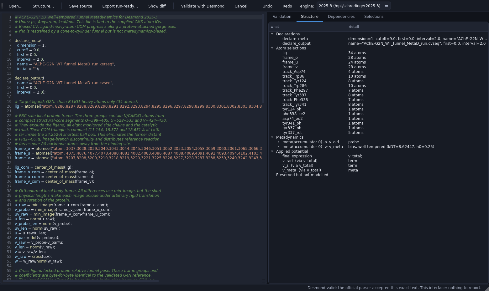

*The screenshot above shows a system this interface has never seen: an
acetylcholinesterase/G2N package produced by a different toolchain. Group names
are `frame_o`/`frame_u`/`frame_v` — none of the names expected by this program.
18 selections were resolved, probe and bias were distinguished, well-tempering
with kΔT = 8.62447 and h₀ = 0.25 was recovered from data flow, and the official
Desmond parser accepted the text.*

Details: [docs/architecture.md](docs/architecture.md),
[docs/diagnostic-codes.md](docs/diagnostic-codes.md),
[docs/official-validation.md](docs/official-validation.md),
[docs/known-limitations.md](docs/known-limitations.md).

---

## 12. Tests

```bash
conda activate cugraph_env
cd /home/bugra/Claude/potantial
python tests/test_funnelforge.py            # 50 core tests
python tests/test_lang.py                   # 39 language/document tests
xvfb-run -a python tests/test_gui.py        # 31 designer-interface tests
xvfb-run -a python tests/test_source_gui.py # 14 source-workbench tests
# or:  python -m pytest tests -q
```

Core tests cover: `.cms` parsing and force-field masses, residue signatures,
`.pot` byte-for-byte round trips, literal preservation, CVs compared with
manual calculations, wall energies, well-tempering arithmetic, box clearance,
exit channel, interpreter/model agreement (scalar and vectorized), **M-expression
language rules** (single assignment, array matching, integer powers with `^`,
blocks/`series`/indexing, `sign`/`pow`/`mod`/`gibbs_*`, rejecting functions not
in Desmond, unary-minus precedence with `^`), static expression validation,
2D potential, selection changes reflected in comments, diagnostic round trips,
**lathe terms, free-form expression terms, continuous region switching,
sphere/window and group targets, term round trips, preservation of disabled
terms, rejection of unmodeled contributions, funnel disabling, term checks,
combined field**, detection of intentional corruptions, `.msj`/`.cfg`/`.sh`
edits, consistent export, and session recording.

Added in this round:

* `test_exported_set_matches_the_desmond_rules` — exports a heavily edited job
  and checks all five files **against Desmond rules**: single assignment in
  `.pot` (excluding declare blocks and comments), no forbidden functions,
  integer exponents, defined `print()` targets, all contributions included in
  `v_total`; `meta = FILE` in `.msj` and `meta_file`/`cfg_file` names matching
  exported names; `meta_file = ?` in `.cfg`, temperature equal to the potential
  T, box ≥ 2 × cutoff; `JOBNAME` match and executable permission in `.sh`; then
  imports again and produces a **byte-for-byte identical** file.
* `test_a_bare_structure_still_exports_a_runnable_set` — a job built from only
  `.cms` still produces all five files, and those files read back cleanly.
* `test_random_editing_never_produces_a_broken_file` — 40 rounds of random
  editing (moving shapes far outside the box, tilting, changing window length,
  adding/removing items, adding diagnostics). Every round must keep everything
  inside the box, keep the two box measurements consistent, keep every axial
  window ordered, and leave Check without errors; export is validated every 20
  rounds and must round-trip byte-for-byte.
* `test_verification_tolerance_is_relative_not_absolute` — demonstrates that
  the relative threshold passes pure rounding but catches a real 10⁻⁶ change in
  an emitted force constant.
* `test_diagnostics_accept_a_residue_number` and
  `test_suggest_groups_never_overwrites_what_you_have` (interface side).

Interface tests cover drawing every representation/color combination, funnel
presets and cameras, panel edits flowing into `.pot` text, handle dragging and
undo, the origin handle shifting the frame, atom selection from 3D, selection
language, adding/removing diagnostics, γ ↔ kTemp, `.cfg`/`.sh` patching,
temperature consistency, funnel suggestion, **building and drawing all four
shape terms, editing and previewing lathe profiles, catching invalid profiles,
expression terms + region switching, disabling the funnel and viewing the
combined field**, individually applying all 34 controls in the Shapes tab,
mouse capture of handles, tilting from the panel and end handles, enforcing the
box boundary in the interface, adding diagnostics by residue number, preserving
existing groups during suggestions, interface export + snapshot, sessions,
probe and validation actions.

---

## 13. Keyboard

| Shortcut | Function |
|---|---|
| `Ctrl+O` / `Ctrl+E` | Import / export job set |
| `Ctrl+S` / `Ctrl+Shift+S` | Save session / save only `.pot` |
| `Ctrl+Z` / `Ctrl+Shift+Z` | Undo / redo |
| `Ctrl+F` / `Ctrl+G` | Fit funnel to pocket / suggest CV groups |
| `1` `2` `3` `4` `5` | Axis / side / fit funnel / fit everything / ligand |
| `F5` / `F6` | Recheck / numerically validate the potential |
| `F9` / `F10` | Right panel / bottom plots |
| `Ctrl+P` | Snapshot |

---

## 14. Notes and limits

* Interface labels are kept exactly equal to `.pot` variable names (`z_cc`,
  `r_cyl`, `cone_slope`, `k_rad`, `k_z`, `h0`, `sigma_z`, `ktemp`), so every
  number shown in a panel can be found visibly in the file.
* `.cms` is never changed: atom order, force field, water, and ions are kept
  exactly as they are; the file is only copied/linked into the job folder.
* Handles are selected on the CPU from the mouse ray, not with VTK's hardware
  selector: hardware selection used to rotate the translucent shell in front,
  making handles impossible to grab. During dragging, events are now stopped
  correctly, so the camera no longer rotates along with the handle.
* If no `.pot` is among the imported files, no constraint is created; the new
  `FunnelSpec` is completely empty (funnel off, zero geometry), and the 3D view
  stays empty accordingly. If a `.pot` with the same base name exists, it is
  imported as a set — intentionally.
* The interpreter evaluates `meta()` calls with zero accumulated bias at t = 0;
  validation therefore checks the initial state of the run (the accumulated
  hill history is created during simulation).
* Depth peeling for transparency is enabled only when the GL context provides
  an alpha plane; you can change it manually with `View ▸ Toggle high-quality
  transparency`. If it cannot be enabled, ordinary alpha blending is used.
* Masses are read from `ffio_sites` (C = 12.01115, N = 14.0067, O = 15.9994,
  S = 32.064), so centers of mass exactly match Desmond's calculation.
* The first `.cms` read takes about 0.9 s; the result is cached under
  `~/.cache/funnelforge`, so subsequent launches are immediate.

---

## 15. Screenshots

| | |
|---|---|
| 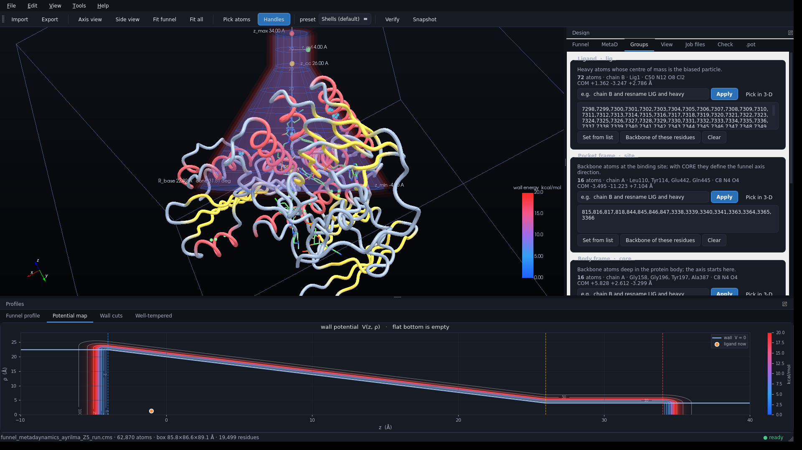 | 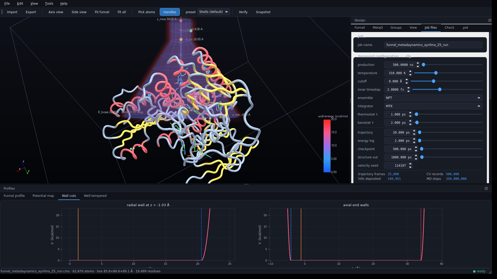 |
| CV groups + potential map | Job files + wall cuts |
| 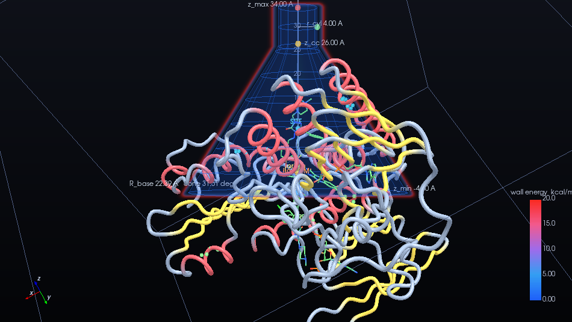 | 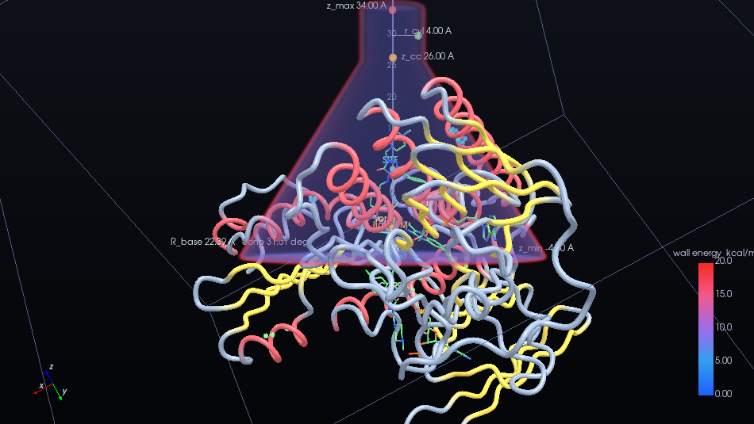 |
| Cross-section plane through the axis | Volumetric glow (shell surrounding the wall) |
| 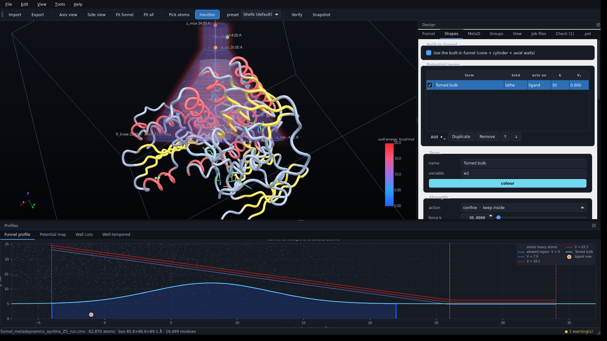 | 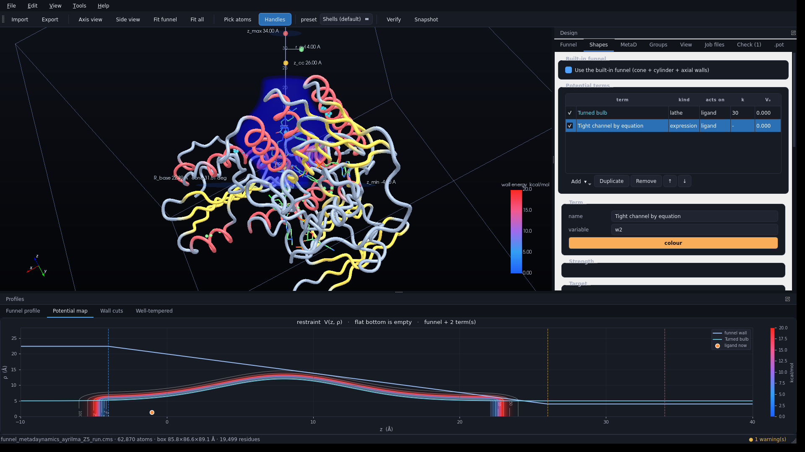 |
| Lathe term: profile, preview, and actual allowed region | Funnel + equal-energy surface of the combined terms |
| 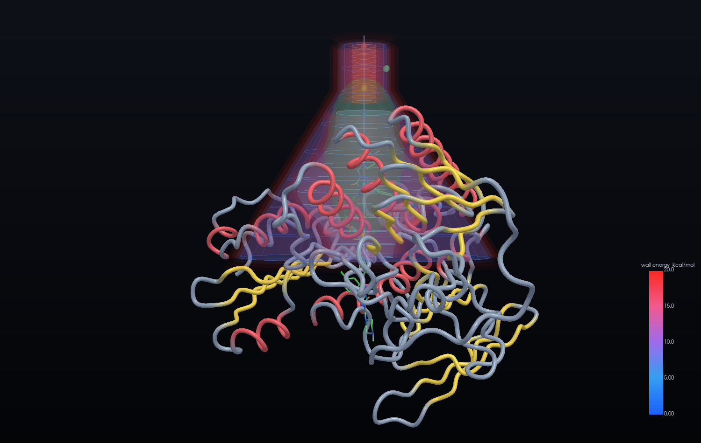 | 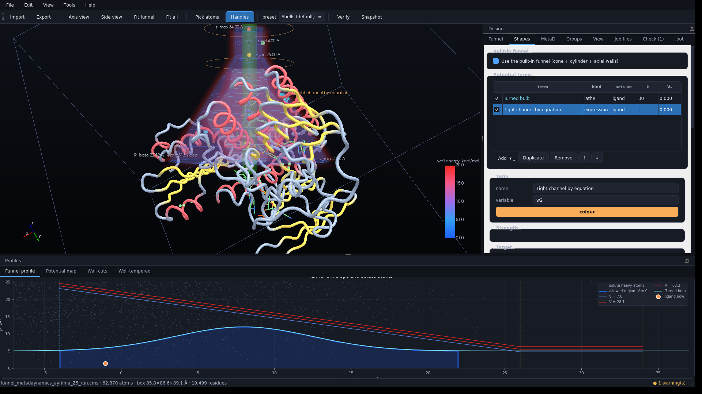 |
| Four separate constraints in the same potential | Expression-defined term (green) and active-region rings |
| 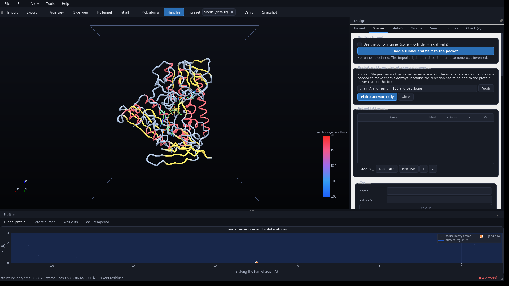 | 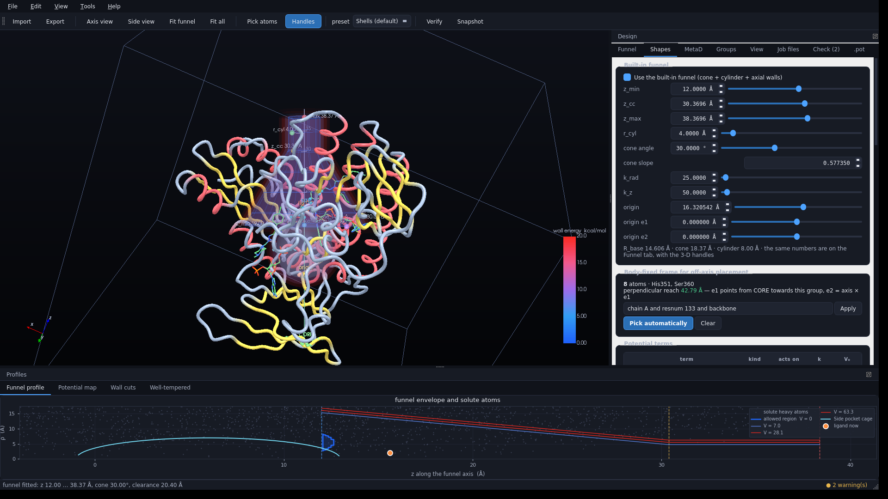 |
| Import without `.pot`: no funnel, nothing fabricated | Full numerical editing and body-fixed frame after adding a funnel |
| 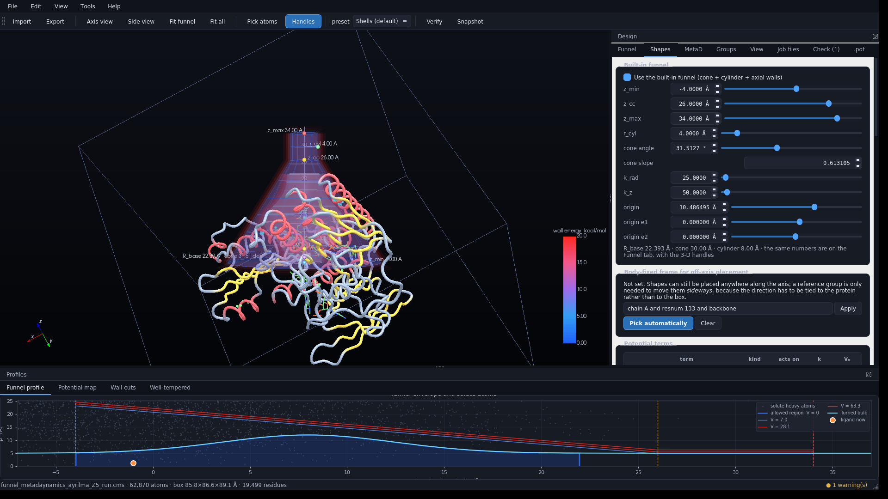 | |
| Handles above a translucent shape: visible and clickable | |

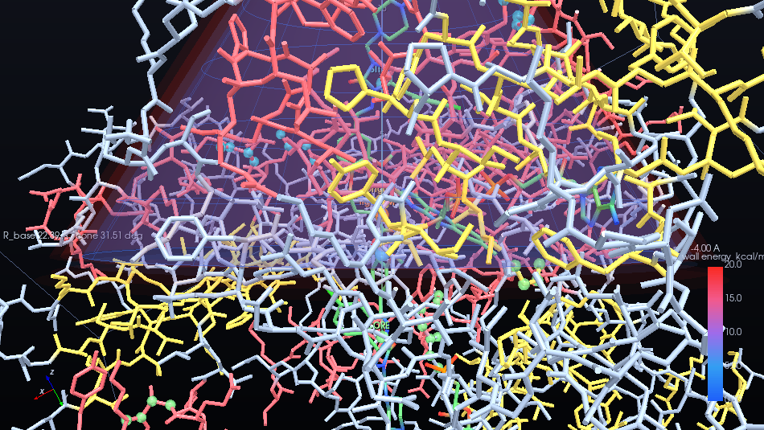

---

## 16. File map

```
funnelforge/
  core/
    maestro.py    Maestro/.cms text-format reader (line-ranged, fast)
    cms.py        Structure model: coordinates, mass, bonds, residues, box, min_image
    elements.py   Element masses, radii, CPK colors, residue classes
    asl.py        Atom selection language
    funnel.py     FunnelSpec + FunnelModel: CVs, wall potential, grids, checks
    terms.py      Shape terms: lathe, sphere, window, free expression + region switching
    potfile.py    .pot parser and generator (byte-for-byte round trip)
    mexpr.py      Desmond M-expression interpreter + static checker (manual section 11)
    blocktext.py  Range-preserving editor for .msj/.cfg brace syntax
    jobfiles.py   CfgFile / MsjFile / ShFile + job-set discovery
    project.py    Job: import, check, validate, export, session
  gui/
    theme.py      Dark theme, color scales
    widgets.py    Precise numeric rows, readouts, issue table
    reps.py       Molecular representations (VTK)
    funnel_actors.py  Funnel surfaces, shells, section, volume, ruler, handles
    viewer.py     3D view, handle dragging, atom selection, camera
    panels.py     Funnel / MetaD / Groups panels
    shapes_panel.py  Shapes tab: term list, lathe preview, expression editor
    panels_job.py Job files / Check / .pot / View panels
    plots.py      Profile plots (matplotlib)
    main_window.py Main window, menus, flow
tests/            Core and interface tests
funnelforge.sh    Launcher
install.sh        Dependency installation + quick test
```
