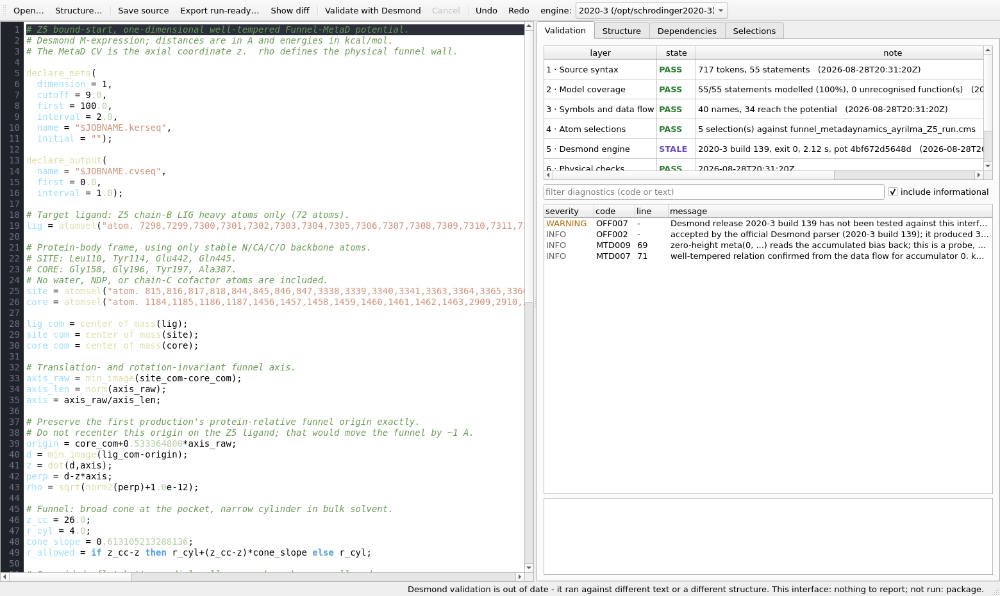

# The source workbench

A guide to opening, reading and checking a Desmond `.pot` file — the raw
enhanced-sampling potential, whatever is in it — and to the headless
`potcheck` command that answers the same questions from a terminal.

The 3-D designer models *one shape* of potential (a well-tempered funnel).
The workbench models the *language*, so it opens any Desmond potential,
including ones the designer cannot draw, and never rewrites what it does not
understand.



---

## 1. Opening a potential

Three ways in:

| How | What happens |
|---|---|
| In the designer: **Tools ▸ Open the source workbench…** (`Ctrl+Shift+S`) | Opens the workbench on the job's `.pot` if one is loaded, and attaches the job's `.cms` automatically |
| `python -m funnelforge.gui.source_window run.pot` | Opens the workbench on its own, with no designer |
| **Open…** (`Ctrl+O`) inside the workbench | A file chooser |

When you open `run.pot` and a file called `run.cms` sits next to it, the
workbench attaches that structure by itself. Otherwise the Selections tab
stays empty until you attach one (§5).

The file is read with its byte-level identity recorded, not normalised: a
UTF-8 byte-order mark, CRLF line endings, mixed line endings and a missing
final newline are all detected, reported, and written back exactly as they
were. That is why a file you open and save without typing is byte-for-byte
the file you started with.

The left half is a plain text editor. It never reformats, re-indents or
re-spells anything. The right half is four tabs — **Validation**,
**Structure**, **Dependencies**, **Selections** — and all four are views of
the text on the left, recomputed about a quarter of a second after you stop
typing.

---

## 2. The seven validation layers

The Validation tab's top table has one row per layer. There is deliberately
no single green light: seven independent questions are asked by seven
different pieces of machinery, and each of them can legitimately have no
answer.

| Row | Question it answers | State when it has nothing |
|---|---|---|
| 1 · Source syntax | Can this program read the file losslessly? | — always runs |
| 2 · Model coverage | How much of the file can it show as structure? | — always runs |
| 3 · Symbols and data flow | Do the names, arities, lengths and dependencies hold together? | — always runs |
| 4 · Atom selections | Do the selections resolve against the `.cms`? | `not run` until you attach one |
| 5 · Desmond engine | What does the installed Schrödinger parser say? | `not run` until you press `F5` |
| 6 · Physical checks | Is the arithmetic sane? | — always runs |
| 7 · Job files | Do the `.pot`, `.cms`, `.msj` and `.cfg` agree? | **never runs — not implemented** (see `known-limitations.md`) |

The state column reads `PASS`, `WARN`, `FAIL`, `not run` or `STALE`.
`not run` and `STALE` are results, not failures: they say the machinery has
no current answer, which is the honest thing to show instead of a green tick.

What each layer means for your file:

**1 · Source syntax.** The lexer and parser here are this program's own, built
from Desmond's `mexp.g` grammar. A `FAIL` on this row is a statement about
*this program*, not about Desmond — and the verdict line says so out loud:

```
; the file does not parse here, which is a limit of this interface and not
proof that Desmond would reject it
```

Nothing is ever discarded. A statement the parser cannot explain becomes an
opaque span that keeps its exact text, and the file still opens, still
displays and still saves unchanged.

**2 · Model coverage.** The note column reads, for example,
`55/55 statements modelled (100%), 0 unrecognised function(s)`. Two things
land here. A statement the parser could not read is `MOD001`
("preserved exactly but not modelled"). A call to a function that is not in
the 2025-3 signature table is `MOD003` — *unrecognised*, not *invalid*:

```
WARNING MOD003  30:7  `quantum_cv()` is not in the 2025-3 function registry;
                      it is preserved unchanged and left for the official
                      validator to judge
```

A `.pot` written for a newer suite therefore opens, displays and saves without
losing a character. The third code, `MOD004`, is the one that matters for
exporting — see §6.

**3 · Symbols and data flow.** Names, single assignment, dependency cycles,
argument counts, and the `declare_meta` ↔ `meta()` agreement. The note reads
`40 names, 34 reach the potential`: a definition that reaches nothing is not
an error and is never presented as one.

**4 · Atom selections.** Covered in §5.

**5 · Desmond engine.** The only layer entitled to the word "valid". Covered
in §7.

**6 · Physical checks.** Only two checks exist today: a constant that folds to
a non-finite number, and a metadynamics hill width that folds to zero or a
negative number. That is a deliberately thin layer, and
`known-limitations.md` lists the checks that are catalogued but not written.

**7 · Job files.** Not implemented. The row is permanently `not run` and the
verdict line always ends `not run: package`.

Below the table is the diagnostics list, with a free-text filter (code, text
or layer name) and an **include informational** checkbox. Clicking a
diagnostic selects the exact character span it refers to in the editor and
prints the long explanation, the evidence and whether it blocks an export
into the panel underneath.

---

## 3. Reading the Structure tab

Five sections, all of them clickable: selecting a row highlights the exact
source span it came from.

**Declarations** — every `declare_meta` and `declare_output`, with the terms
exactly as written:

```
declare_meta     dimension=2, cutoff=9.0, first=100.0, interval=2.0,
                 name="metad_2d_wt.kerseq", initial=""
declare_output   name="metad_2d_wt.cvseq", first=0.0, interval=1.0
```

**Atom selections** — one row per name whose value is an `atomsel(...)`.
Without a structure the detail column reads `unresolved`; with one it reads
the atom count.

**Metadynamics** — one row per `meta()` call, at any nesting depth, whether or
not it is bound to a name. The row label is
`meta(accumulator N) -> name`, the detail is the call's *role* and, when the
data flow proves it, the well-tempered parameters. Two children hang off each
row: `evidence` (the sentence explaining how the classification was reached)
and `collective variables` (how many CVs the call passes).

**Applied potential** — the file's last expression statement, then its
additive terms. A term that is just a name whose definition is itself a sum
is expanded, and the chain it was reached through is recorded, so you see the
real contributions rather than the word `v_total`:

```
final expression        v_total;
v_rad  (via v_total)    term
v_z    (via v_total)    term
v_meta (via v_total)    meta
```

Two things to know about this list. Subtraction is flattened along with
addition, so `v = a - b` is shown as the two terms `a` and `b` — the minus
sign is not carried into the label. And the `meta`/`wall` tag is looked for
only in the term's own definition, one level deep: in the reference job the
funnel walls are written as `v_rad = 0.5*k_rad*rad_excess^2` with the `if`
living in `rad_excess`, so `v_rad` is tagged `term`, not `wall`. The tag is a
hint, not a claim.

**Preserved but not modelled** — the honest inventory of what the structured
view does not understand: every unrecognised function with its call count,
and every unparsed statement with the first 70 characters of its text. If
this section is empty, the structured view accounts for the whole file.

### The Dependencies tab

Pick a name from the drop-down and you get its definition, its inferred type,
whether it reaches the potential, whether it reaches a side effect
(`print`, `store`, `meta`), what it reads directly and transitively, what
reads it directly and transitively, and every line where it is used:

```
z = dot(d,axis)
  defined at line 41
  type            scalar
  reaches the potential : yes
  reaches a side effect : yes

reads directly:   axis, d
reads in total:   axis, axis_len, axis_raw, core, core_com, d, lig, lig_com,
                  origin, site, site_com
read directly by: high_excess, low_excess, perp, r_allowed, v_meta, v_old
read in total by: high_excess, hill, low_excess, perp, r_allowed, rad_excess,
                  rho, v_meta, v_old, v_rad, v_total, v_z

used at 10 place(s):
   line 42:10
   line 49:21
   ...
```

(the reference job's progress coordinate; the panel lists up to 40 use sites)

"Reaches a side effect but not the potential" is the answer for a group that
exists only to be printed as a diagnostic CV. That is not dead code, and the
program will not call it dead.

---

## 4. probe, bias, and "well-tempered confirmed"

Every `meta()` call gets a role. The classification is on the *data flow*, not
on what anything is called, so a file whose variables are `grpA`/`total`
is read exactly as well as one using `lig`/`v_meta`.

| Role | What it means | How it is decided |
|---|---|---|
| `probe` | A zero-height call. It deposits nothing; it reads the bias already accumulated in that well back out. | Every element of the hill array folds to `0.0` |
| `bias` | Its value reaches the final energy expression. This is a term your simulation actually feels. | The call is in the dependency closure of the last statement |
| `intermediate` | It feeds something else that is read, but not the energy directly | Bound to a name that is used somewhere |
| `diagnostic` | It only ever reaches a `print()` | In a `print` argument's closure |
| `undetermined` | None of the above — the analysis will not guess | — |

`probe` is decided first. A zero-height call is reported as a probe even if
its value also reaches the energy, because a zero-height deposit adds nothing
either way.

**"well-tempered confirmed"** is a much stronger statement, and it is only
made when the arithmetic actually holds:

* the hill height's data flow contains an `exp()`;
* that `exp()`'s argument reads a **zero-height `meta()` on the same
  accumulator** — the bias already deposited in that well;
* and that term enters the exponent with a **negative** coefficient.

All three are checked structurally, through however many intermediate
assignments the algebra is spread over. `tests/fixtures/metad_2d_wt.pot`
deliberately smears the relation across eight bindings, puts the minus sign in
a binding of its own (`neg_delta_t = 0.0 - delta_t`), and separates the probe
from the deposit by four unrelated statements. It is still confirmed, and the
bias temperature is recovered:

```
INFO  MTD007  well-tempered relation confirmed from the data flow for
              accumulator 0. kDT = 8.62447 kcal/mol, h0 = 0.1 kcal/mol
      evidence: the hill height reads accumulator 0 back through exp() with a
                negative coefficient; kDT = 8.62447 kcal/mol; h0 = 0.1 kcal/mol
```

`kDT` is (γ−1)·k_B·T in kcal/mol; `h0` is the initial hill height, recovered
only when the height is written as a product with a literal factor.

**"well-tempering not confirmed"** (`MTD008`) is not an error. It means one of
the three conditions above could not be established, and the evidence line
says which:

```
WARNING MTD008  MetaD detected on accumulator 0; well-tempered construction
                not confirmed
        evidence: no exp() in the hill height's data flow
```

For a plain (non-tempered) metadynamics run that is the correct and expected
answer. For a run you *believe* is well tempered, it is a flag: either the
tempering is written in a form the data-flow test cannot follow, or it is not
there. Each accumulator is judged separately —
`tests/fixtures/multi_accumulator.pot` has accumulator 0 confirmed and
accumulator 1 not, in the same file.

`MTD009` marks the probe itself, so a two-call well-tempered file produces one
`MTD009` and one `MTD007`.

---

## 5. Attaching a `.cms`, and the Selections tab

**Structure…** (`Ctrl+T`) attaches a Maestro `.cms`. Layer 4 then runs and
the Selections tab fills in, one row per `atomsel(...)`:

| name | atoms | chains | residues | selection |
|---|---|---|---|---|
| `lig` | 72 | B | B:LIG1 | `atom. 7298,7299,7300,…` |
| `site` | 16 | A | A:GLN445, A:GLU442, A:LEU110, A:TYR114 | `atom. 815,816,817,818,844,…` |
| `core` | 16 | A | A:ALA387, A:GLY158, A:GLY196, A:TYR197 | `atom. 1184,1185,1186,1187,…` |
| `tyr114_oh_sel` | 1 | A | A:TYR114 | `atom. 855` |
| `tyr197_oh_sel` | 1 | A | A:TYR197 | `atom. 1471` |

(the reference job, `funnel_metadaynamics_ayrilma_Z5_run`; the selection column
is shown truncated here, the table shows it in full)

Nothing in your file is rewritten by this. Selections are counted and
described; the text on disk is untouched.

Four things can be reported:

* **`TOP001`** — the selection matches no atoms in this structure. Usually a
  `.cms` / `.pot` mismatch.
* **`TOP002`** — an atom id outside `1..N`. The row is truncated at that
  point.
* **`TOP003`** — the selection includes water or ions. Sometimes deliberate,
  so it is a warning and nothing is changed.
* **`TOP008`** — *this program's* selection reader could not evaluate the
  string. That is a statement about this program, never about Desmond: the
  text is preserved and left for the engine to judge.

```
WARNING TOP008  `maestro`: this interface's selection reader could not
                evaluate 'chain. A and backbone'; it is preserved unchanged
                and left to Desmond
        evidence: unknown selection keyword 'chain.'
```

The reader understands the `atom. <ids>` list form that Desmond potentials
overwhelmingly contain, plus a small local selection language
(`chain A`, `resnum 114`, `protein`, `within 5 of …`, and so on). It does
**not** understand Maestro's dotted ASL (`chain. A`, `res. 114`, `a. CA`).
`known-limitations.md` gives the exact list of what works and what does not,
and describes an off-by-one defect in the residue summary for selections that
go through the local language. Treat the **atoms** column as reliable and the
**chains/residues** columns as an aid.

---

## 6. Save source vs Export run-ready

These are deliberately far apart in the toolbar, and they are not two flavours
of the same thing.

**Save source** (`Ctrl+S`) writes exactly the bytes you have, atomically, with
the original encoding, BOM and line endings. It is *always* available. A file
this program cannot fully model is still a file you may edit and keep. If the
file changed on disk under you since it was opened, you are asked before
anything is overwritten; a temporary file is written and `os.replace`d into
position, so a save either lands whole or does not happen.

**Export run-ready** (`Ctrl+E`) is the strict path, and it refuses unless
every gate holds. The gates are:

| Refusal | Meaning |
|---|---|
| any diagnostic flagged `blocks export` | e.g. `SYN001`, `SEM001`, `MTD004`, `TOP001` |
| `MOD004` | something the program cannot model contributes to the potential — a structured export could drop physics |
| `OFF001` | the installed Desmond parser has not been run on this text |
| `OFF008` | the text changed after the last official validation |
| `OFF003` | the engine rejected this text |
| `OFF009` | the topology changed after the last official validation |

The refusal dialog names every blocker and ends with the reminder that saving
the source is still available and is lossless. Nothing is written before the
checks pass, so a refused export never touches the file on disk.

The `MOD004` case is the interesting one. Given

```
future = z @@ 3.0 from_the_future;
v = 0.5 * 10.0 * z^2 + future;
v;
```

the interface reports

```
WARNING MOD001  4:1   this construct is preserved exactly but is not modelled
                      by the structured view
                      evidence: future = z @@ 3.0 from_the_future;
WARNING MOD004  5:24  an unmodelled construct contributes to the potential, so
                      a structured export could silently drop physics
                      evidence: future
```

and the Applied potential section shows

```
+ 0.5 * 10.0 * z^2  (via v)
+ OPAQUE future     (via v)
```

Save source still works and still round-trips those bytes exactly.

> **Known defect.** In the current build the toolbar's *Export run-ready*
> button never writes a file, even when every gate is satisfied: it re-checks
> the gates against a document copy on which no layer has been run, finds
> `OFF001`, and returns silently without a message. Until that is fixed, use
> **Save source** to a new path — it is byte-identical and lossless — or the
> library call `Document.export_run_ready(path)`. See
> `known-limitations.md`.

**Show diff** (`Ctrl+D`) shows a unified diff of the editor against the file
on disk before you commit to either.

---

## 7. Running the official validation

`F5` — **Validate with Desmond** — runs the real
`schrodinger.application.desmond.enhsamp` parser in a subprocess, out of
process, under a scrubbed environment, in a throwaway directory, in its own
process group. `Esc` cancels it. The **engine:** drop-down in the toolbar
chooses which installed suite to use; it defaults to the same one the headless
CLI would pick, so the two cannot disagree.

This is the only layer allowed to justify the word *valid*. Until it has
passed against the current text, the status bar says:

```
Desmond validation not performed. This interface: nothing to report;
not run: topology, package.
```

and after it passes:

```
Desmond-valid: the official parser accepted this exact text. This interface:
nothing to report; not run: package.
```

**A validation without a `.cms` is refused, not faked.** Attach a structure
first. Without one the engine builds an `ASLObject(None)` that cannot resolve
selections against a structure — it falls back to a workaround that only
understands a literal `atom. <indices>` selection and assumes
`gid == atid - 1`, which Schrödinger's own comment marks as wrong for FEP with
metadynamics and for molecules with virtual sites. A pass obtained that way
would not mean the potential is valid for your system, so the layer reports
`not run` with that explanation rather than a green tick.

**The result goes stale the moment you type.** Every result is tagged with a
digest of the text it was computed from. When the text changes, the recorded
answer no longer matches, and row 5 flips to `STALE`:

```
Desmond validation is out of date - it ran against different text or a
different structure.
```

That is also true if the `.cms` changes on disk (`OFF009`). Nothing silently
keeps a verdict that belonged to a different input, and a slow answer that
arrives after you have moved on is discarded rather than shown:

```
the text changed while Desmond was parsing; that result describes older text
and was discarded
```

Two more things the engine layer says on its own account:

* `OFF004` — no usable Schrödinger installation found. Set `$SCHRODINGER` to a
  suite directory containing `run`. The message lists every directory that was
  looked at and why each was unusable.
* `OFF007` — the suite is a release the message-reading code here has not been
  exercised against. Its verdict still stands; only the way its messages are
  parsed may be out of date. Today this fires for everything except 2025-3.

---

## 8. Keyboard shortcuts

Read out of `funnelforge/gui/source_window.py`.

| Key | Action |
|---|---|
| `Ctrl+O` | Open a `.pot` file |
| `Ctrl+T` | Attach a `.cms` so atom selections can be resolved |
| `Ctrl+S` | Save source — write the text exactly as it is, byte for byte |
| `Ctrl+E` | Export run-ready — write only if every layer allows it |
| `Ctrl+D` | Show diff against the file on disk |
| `F5` | Validate with the installed Desmond parser |
| `Esc` | Cancel the running validation |
| `Ctrl+Z` | Undo (the editor's own undo stack) |
| `Ctrl+Shift+Z` | Redo |

And in the designer window: `Ctrl+Shift+S` opens the workbench.

The layer table, the diagnostics tree, the structure tree, the selections
table and the editor all carry accessible names, so the whole window is
reachable by keyboard and by a screen reader. Severity is shown as a word
(`ERROR`, `WARNING`, `INFO`) as well as a colour.

---

## 9. The headless CLI: `python -m funnelforge.potcheck`

The same core library, the same seven layers, the same diagnostic codes — no
display needed. A result in a terminal and a result on screen cannot disagree,
because they come from the same `Document`.

```
python -m funnelforge.potcheck run.pot
python -m funnelforge.potcheck run.pot --cms run.cms --official
python -m funnelforge.potcheck tests/fixtures/*.pot --json > report.json
```

### Options

| Option | Effect |
|---|---|
| `--cms PATH` | Topology to resolve selections against and to validate with |
| `--official` | Run the installed Schrödinger/Desmond parser |
| `--schrodinger PATH` | Use this installation instead of the newest found |
| `--timeout SECONDS` | Official-validation timeout (default 180) |
| `--json` | Machine-readable output for every file, as one JSON array |
| `--all` | Include informational diagnostics (they are hidden by default) |
| `--quiet` | Messages only — no evidence or suggestion lines |
| `--no-overview` | Suppress the `-- structure` block |
| `--list-installations` | List the Schrödinger suites found, then exit |
| `--max-bytes N` | Refuse a file larger than this (default 32 MiB) |

### Exit codes

| Code | Meaning |
|---|---|
| 0 | Every layer that ran passed |
| 1 | At least one layer reported an error |
| 2 | A file could not be read at all |
| 3 | `--official` was requested and could not be run |

### A clean file

```console
$ python -m funnelforge.potcheck tests/fixtures/metad_2d_wt.pot --all
== tests/fixtures/metad_2d_wt.pot
syntax    PASSED   nothing to report                  2026-08-28T20:45:44Z  67b10bfb21f0f487...
          note: 493 tokens, 37 statements
model     PASSED   2 info                             2026-08-28T20:45:44Z  67b10bfb21f0f487...
          note: 37/37 statements modelled (100%), 0 unrecognised function(s)
symbols   PASSED   nothing to report                  2026-08-28T20:45:44Z  67b10bfb21f0f487...
          note: 30 names, 30 reach the potential
topology  NOT_RUN  nothing to report                  never                 -
official  NOT_RUN  nothing to report                  never                 -
lint      PASSED   nothing to report                  2026-08-28T20:45:44Z  67b10bfb21f0f487...
package   NOT_RUN  nothing to report                  never                 -
  INFO    MTD009      51:17  zero-height meta(0, ...) reads the accumulated bias back; this is a probe, not a deposit
  INFO    MTD007      62:10  well-tempered relation confirmed from the data flow for accumulator 0. kDT = 8.62447 kcal/mol, h0 = 0.1 kcal/mol
          evidence: the hill height reads accumulator 0 back through exp() with a negative coefficient; kDT = 8.62447 kcal/mol; h0 = 0.1 kcal/mol
  verdict: Desmond validation not performed. This interface: nothing to report; not run: topology, package.
  -- structure
     statements        37
     names             30 (30 reach the potential)
     selection lig            unresolved (no structure supplied)
     selection site           unresolved (no structure supplied)
     selection core           unresolved (no structure supplied)
     declare_meta #0    dimension=2 name='metad_2d_wt.kerseq'
     meta(acc 0) -> v_accumulated    probe
     meta(acc 0) -> v_bias           bias, well-tempered (kDT=8.62447)
     potential         v_bias;
       + v_bias [meta]

$ echo $?
0
```

(The revision digests are shown truncated here; the tool prints the full
SHA-256 of the text.)

### With a structure and the real engine

```console
$ python -m funnelforge.potcheck funnel_metadaynamics_ayrilma_Z5_run.pot \
      --cms funnel_metadaynamics_ayrilma_Z5_run.cms --official --all
== funnel_metadaynamics_ayrilma_Z5_run.pot
syntax    PASSED   nothing to report          2026-08-28T20:35:46Z  4bf672d5648d1f7d...
          note: 716 tokens, 55 statements
model     PASSED   2 info                     2026-08-28T20:35:46Z  4bf672d5648d1f7d...
          note: 55/55 statements modelled (100%), 0 unrecognised function(s)
symbols   PASSED   nothing to report          2026-08-28T20:35:46Z  4bf672d5648d1f7d...
          note: 40 names, 34 reach the potential
topology  PASSED   nothing to report          2026-08-28T20:35:46Z  4bf672d5648d1f7d...
          note: 5 selection(s) against funnel_metadaynamics_ayrilma_Z5_run.cms
official  PASSED   1 info                     2026-08-28T20:35:48Z  4bf672d5648d1f7d...
          note: 2025-3 build 160, exit 0, 1.83 s, pot 4bf672d5648d
lint      PASSED   nothing to report          2026-08-28T20:35:46Z  4bf672d5648d1f7d...
package   NOT_RUN  nothing to report          never                 -
  INFO    OFF002          -  accepted by the official Desmond parser (2025-3 build 160); it produced 3476 characters of backend configuration
  INFO    MTD009       69:9  zero-height meta(0, ...) reads the accumulated bias back; this is a probe, not a deposit
  INFO    MTD007      71:10  well-tempered relation confirmed from the data flow for accumulator 0. kDT = 8.62447 kcal/mol, h0 = 0.1 kcal/mol
  verdict: Desmond-valid: the official parser accepted this exact text. This interface: nothing to report; not run: package.
  -- structure
     statements        55
     names             40 (34 reach the potential)
     selection lig                72 atoms  chain B  B:LIG1
     selection site               16 atoms  chain A  A:GLN445, A:GLU442, A:LEU110, A:TYR114
     selection core               16 atoms  chain A  A:ALA387, A:GLY158, A:GLY196, A:TYR197
     selection tyr114_oh_sel       1 atoms  chain A  A:TYR114
     selection tyr197_oh_sel       1 atoms  chain A  A:TYR197
     declare_meta #0    dimension=1 name='$JOBNAME.kerseq'
     meta(acc 0) -> v_old            probe
     meta(acc 0) -> v_meta           bias, well-tempered (kDT=8.62447)
     potential         v_total;
       + v_rad  (via v_total)
       + v_z  (via v_total)
       + v_meta  (via v_total) [meta]
```

The whole run took 2.0 s wall clock, of which 1.8 s was the engine reading the
62 870-atom topology. Without `--official` the same command takes 0.17 s.

### `--official` without `--cms`

Refused, with the reason, and exit code 3:

```console
$ python -m funnelforge.potcheck tests/fixtures/metad_1d.pot --official
...
official  NOT_RUN  1 info                              never                 -
          note: official validation needs a topology. Without a .cms the engine
          builds ASLObject(None), which cannot resolve atom selections against a
          structure: it falls back to a workaround that understands only a literal
          "atom. <indices>" selection and assumes gid == atid - 1, and raises
          RuntimeError("Failed to get gid from asl ('...') without structure.") for
          every other ASL. ... Supply the .cms the job will actually run against.
$ echo $?
3
```

### Files with real problems

```console
$ python -m funnelforge.potcheck tests/fixtures/dimension_mismatch.pot --no-overview
  ERROR   MTD004      33:10  declare_meta says dimension = 2 but this call passes 3 collective variable(s)
  ERROR   MTD005      33:10  the hill array should hold one height and 2 width(s), that is 3 values; this call passes 4
  WARNING MTD008      33:10  MetaD detected on accumulator 0; well-tempered construction not confirmed
  verdict: Desmond validation not performed. This interface: 2 errors, 1 warning; not run: topology, package.
$ echo $?
1
```

Other one-line examples from the fixture corpus:

```
undefined_symbol.pot   ERROR SEM001 15:15  `ghost_offset` is used but never defined
dependency_cycle.pot   ERROR SEM003 14:1   definitions depend on each other in a cycle: a -> b -> a
duplicate_assign.pot   ERROR SEM002 16:1   `k_wall` is assigned again; Desmond allows a single
                                            assignment per name in a scope (first at line 11)
bad_accumulator.pot    ERROR MTD003 27:10  meta(7, ...) refers to accumulator 7 but the file declares 1
```

### Which suites are visible

```console
$ python -m funnelforge.potcheck --list-installations run.pot
/opt/schrodinger  ? build ?  no 'run' wrapper in this directory
/opt/schrodinger2020-3  2020-3 build 139  usable
/opt/schrodinger2025-3  2025-3 build 160  usable
```

Pinning an older suite adds `OFF007`, because only 2025-3 has been exercised
against this program's message reader:

```console
$ python -m funnelforge.potcheck tests/fixtures/metad_2d_wt.pot --cms system.cms \
      --official --schrodinger /opt/schrodinger2020-3 --all --no-overview
official  PASSED   1 info, 1 warning   2026-08-28T20:45:06Z  67b10bfb21f0f487...
          note: 2020-3 build 139, exit 0, 2.14 s, pot 67b10bfb21f0
  WARNING OFF007  Desmond release 2020-3 build 139 has not been tested against this
                  interface; its verdict still stands, but the way its messages are
                  read here may be out of date
  INFO    OFF002  accepted by the official Desmond parser (2020-3 build 139); it
                  produced 2702 characters of backend configuration
  verdict: Desmond-valid: the official parser accepted this exact text. ...
```

### JSON

`--json` prints one array with one object per file. Every object carries the
text revision, the verdict sentence, the seven layer states with the revision
each was computed against, every diagnostic, the structural summary
(statements, names, which names reach the potential, selections, every
`meta()` call with its role and well-tempered evidence, the additive
contributions, unrecognised functions, opaque spans), the selection table, the
official run's manifest, and the export blockers:

```json
{
 "file": "tests/fixtures/minimal.pot",
 "revision": "c9e484d386ae012a569c96ed8dbcc373c9a1aad14260732121cca120cb75fa65",
 "verdict": "Desmond validation not performed. This interface: nothing to report; not run: topology, package.",
 "layers": {
  "syntax": {"state": "passed", "note": "37 tokens, 2 statements",
             "ran_at": "2026-08-28T20:41:36Z", "source_rev": "c9e484d386ae..."},
  "official": {"state": "not_run", "note": "", "ran_at": "", "source_rev": ""}
 },
 "diagnostics": [
  {"code": "MTD001", "layer": "model", "severity": "info", "line": 0, "col": 0,
   "message": "no meta() call was found, so this file applies no metadynamics bias",
   "evidence": "", "blocks_export": false}
 ]
}
```

The official manifest (present only after `--official`) records the SHA-256 of
both inputs, the exact `argv`, the suite path, version and build, the exit
code, the timestamp and the duration — enough to re-run the verdict later and
get the same answer, or to dispute it.

---

## See also

* `docs/diagnostic-codes.md` — every code, what it means, what it blocks.
* `docs/known-limitations.md` — read this before trusting any layer.
* `docs/threat-model.md` — what happens to a `.pot` from an untrusted source.
